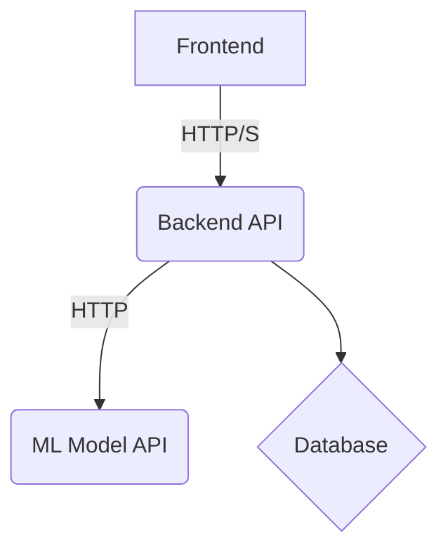

# Architecture

This document provides a detailed overview of the architecture of the Signature Authentication Prototype.

## High-Level Overview

The application is a classic three-tier architecture:

1.  **Frontend:** A static web application that provides the user interface.
2.  **Backend:** A Node.js application that provides a RESTful API.
3.  **ML Model:** A Python application that provides a machine learning service.

## Component Diagram

## Component Descriptions

### Frontend

*   **Technology:** HTML, CSS, JavaScript
*   **Responsibilities:**
    *   Provides the user interface for registration and authentication.
    *   Captures signature data from the user.
    *   Communicates with the backend API to send and receive data.

### Backend

*   **Technology:** Node.js, Express.js, PostgreSQL
*   **Responsibilities:**
    *   Provides a RESTful API for the frontend.
    *   Handles user management (registration, login, etc.).
    *   Stores and retrieves data from the database.
    *   Communicates with the ML model API to get signature verification predictions.

### ML Model

*   **Technology:** Python, Flask, scikit-learn
*   **Responsibilities:**
    *   Provides a RESTful API for the backend.
    *   Trains and loads the signature verification model.
    *   Provides predictions on whether a signature is genuine or a forgery.

## Data Flow

### Registration

1.  The user enters their information and provides a signature on the frontend.
2.  The frontend sends the user information and signature data to the backend API.
3.  The backend stores the user information and signature data in the database.

### Authentication

1.  The user enters their username and provides a signature on the frontend.
2.  The frontend sends the username and signature data to the backend API.
3.  The backend retrieves the user's stored signature data from the database.
4.  The backend sends the stored signature data and the new signature data to the ML model API.
5.  The ML model API compares the two signatures and returns a prediction.
6.  The backend returns the prediction to the frontend.
